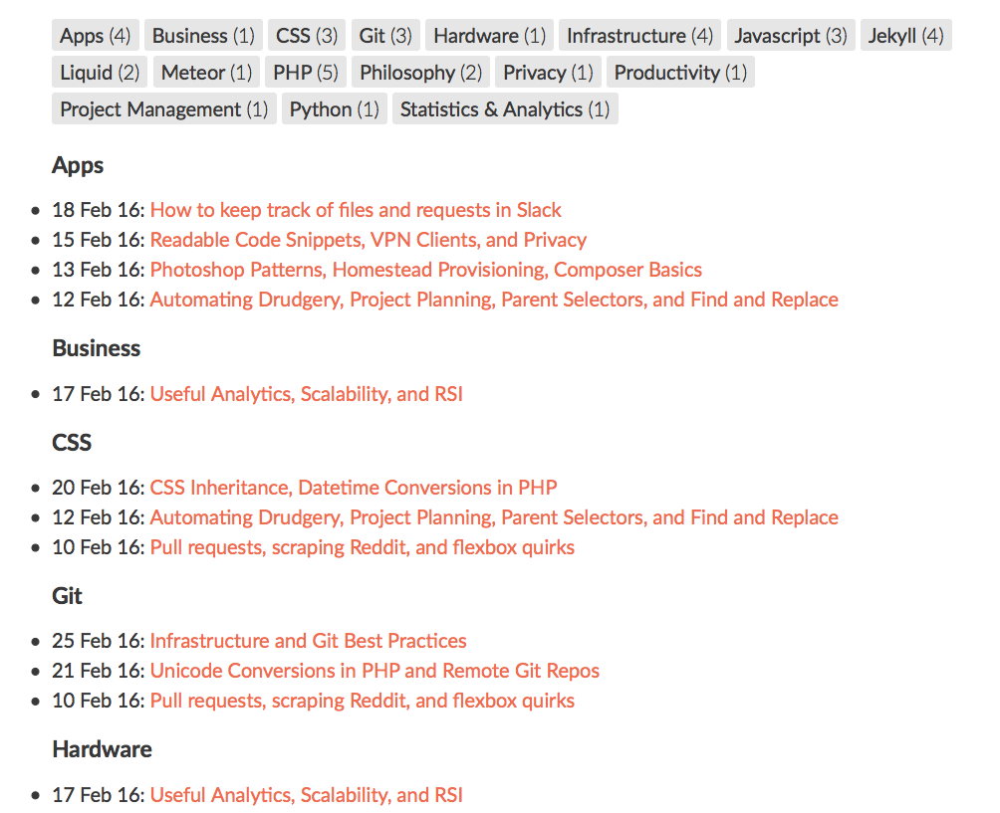
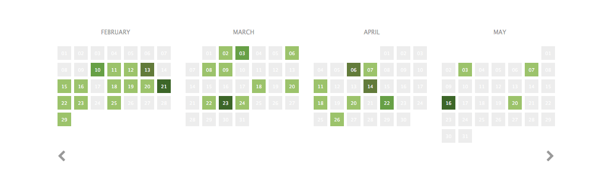

# Jekyll Tools
A collection of templates I made for my [Jekyll](http://jekyllrb.com)-powered [blog](http://cagrimmett.com). I thought that other people might want to use them, so I tossed them up here.

The collection so far:

- [A template for adding social metadata (Open Graph and Twitter Cards) to posts and pages](#social-metadata)
- [A template for adding Disqus comments](#comments-via-disqus)
- [A template for listing posts by tag](#posts-by-tag)
- [A posts heatmap calendar](#posts-heatmap-calendar)
- [Options for Search on a Jekyll site](#search)
- [A template for filtering categories with Isotope](#filtering-categories-with-isotope)
- [A Jekyll Collection template for Book Reviews, complete with star ratings](#collection-template-for-book-reviews)
- [Moving your Jekyll Site to Amazon S3 and Cloudfront with Outside DNS](http://www.cagrimmett.com/development/2017/04/08/migrating-jekyll-to-s3-cloudfront.html)
- [Moving WordPress posts to Jekyll](http://www.cagrimmett.com/development/2018/01/21/website-rebuild-and-revival.html)
- [Improving Jekyll Build Time](http://www.cagrimmett.com/til/2018/04/02/improving-jekyll-build-time.html)

---

## Social Metadata
The `social_metadata.html` file is a template for easily adding [Open Graph](http://ogp.me) and [Twitter Cards](https://dev.twitter.com/cards/markup) metadata for your Jekyll posts. The Liquid markup relies on some settings from your `_config.yml` file and some settings from the YAML front-matter on each post.

### Implementation
- Place the `social_metadata.html` file in the `_includes` folder [inside your Jekyll site](https://jekyllrb.com/docs/structure/).
- Include the file inside the `<head> </head>` tags on your post pages. Most Jekyll themes make the headers a separate file that is itself included in other templates. It is usually called something like `header.html` or `head.html` and usually also lives inside the `_includes` folder.
- You can include it with Liquid like this:
~~~~liquid

~~~~

Make sure the following items are defined in your `_config.yml` file ([learn more here](https://jekyllrb.com/docs/configuration/)). Replace my examples with your own info:
~~~~yaml
title: Chuck Grimmett's GitHub
url: "" # the subpath of your site, e.g. /blog/
baseurl: "http://example.com" # the base hostname & protocol for your site
locale: en_US # language_territory is the default
theme:
	description: "This is my awesome Jekyll site"
	avatar: "/link/to/img.jpg"
	twitter: "username" # Don't include @
~~~~

Make sure the following items are defined in your posts' [front matter](https://jekyllrb.com/docs/frontmatter/):
~~~~yaml
---
title:
author:
date: YYYY-MM-DD
feature-img: "/link/to/img.jpg"
excerpt: This post is about blah blah blah...
---
~~~~

Don't just copy and paste the above blocks. Some of these are probably already in your `_config.yml` file or your posts' front matter. Add what is missing to the correct section. Be mindful of indentation.

### Validation
- [Validate your Open Graph metadata with Facebook's Debugger](https://developers.facebook.com/tools/debug)
- [Validate your Twitter Cards with Twitter's Card Validator](https://cards-dev.twitter.com/validator)

---

## Comments via Disqus
The `disqus.html` is a way to add Disqus commenting to your Jekyll posts. Disqus also [provides instructions for an alternative way](https://help.disqus.com/customer/portal/articles/472138-jekyll-installation-instructions).

### Implementation
- Put the `disqus.html` file in the `_includes` folder [inside your Jekyll site](https://jekyllrb.com/docs/structure/).
- Register your site on [Disqus](http://disqus.com/register)

Under `theme:` in your `_config.yml` file ([learn more here](https://jekyllrb.com/docs/configuration/)), define your [Disqus shortname](https://help.disqus.com/customer/portal/articles/466208-what-s-a-shortname-):
~~~~yaml
theme:
	disqus_shortname: "exampleshortname"
~~~~

Put this snippet in the post where you want your comments to show up. I put mine at the bottom of my posts template, just before the footer.
~~~~liquid
<!-- Disqus -->


  


~~~~

---

## Posts by Tag
`posts_by_tag.md` is a page that displays the site's tags in alphabetical order and shows how many posts there are per tag, makes anchor links for each tag, then outputs posts by tag in reverse chronological order. You can see it in practice at the [bottom of my Today I Learned page](http://cagrimmett.com/category/TIL). It will end up looking like this:

### Implementation
Put the `posts_by_tag.md` file at the root of [your Jekyll site](https://jekyllrb.com/docs/structure/). After your generate your site via `$ jekyll build`, it will be available at http://yoursitename.com/tags/

Add tags to your posts by including them in your posts' [front matter](https://jekyllrb.com/docs/frontmatter/):
~~~~yaml
---
tags:
- Foo
- Bar
---
~~~~

### CSS
Here are the styles for the classes that are set in the `posts_by_tag.md` file for the layout of the tags. Include them in your site's CSS file:
~~~~css
ul.tag-box li {
	display: inline-block;
	list-style: none;
	list-style-image: none;
	margin-bottom: 7px;
}
ul.tag-box li a {
	background: #e6e6e6;
	padding: 4px 8px;
	border-radius: 3px;
	color: #F76B48;
}
ul.tag-box li span.size {
	font-weight: 300;
}
~~~~

---

## Posts Heatmap Calendar

This heatmap calendar gives you a visual representation of when you posted on your Jekyll site. It loops through all of your posts, counts how many posts you have each day, creates a JSON string to hold them, then uses [moment.js](http://momentjs.com), [D3.js](http://d3js.org) and [Cal-HeatMap](http://cal-heatmap.com) to visualize them.

It automatically loads the current month on the right and it has responsive breakpoints at 1400px, 730px, and 420px. It will work on Github Pages because it doesn't need any additional plugins to run. It only uses Liquid to do the counting and build the JSON string.

See it in action at [http://cagrimmett.com/2016/07/06/posts-heatmap-calendar.html](http://cagrimmett.com/2016/07/06/posts-heatmap-calendar.html)

### Implementation
Put the `posts_heatmap_calendar.md` file at the root of [your Jekyll site](https://jekyllrb.com/docs/structure/). After your generate your site via `$ jekyll build`, it will be available at http://yoursitename.com/posts-cal/

Alternatively, here is how you can include it on any Jekyll-generated page:

1) Put these includes in the file's header:
~~~~html

<link href="//maxcdn.bootstrapcdn.com/font-awesome/4.4.0/css/font-awesome.min.css" rel="stylesheet">
<link rel="stylesheet" href="//cdn.jsdelivr.net/cal-heatmap/3.3.10/cal-heatmap.css" />

~~~~

Note: I'm only using FontAwesome for the left and right arrows under the calendar. I included it because I use it elsewhere on my site, so it is always available in the header. If you don't want to use it, feel free to replace the arrows with `&larr;` and `&rarr;`.

2) Include this Javascript in the footer to build the JSON, generate the calendar, and drive the responsiveness:
~~~~javascript

~~~~

3) Put this HTML on the page where you want the calendar to show up:
~~~~html

	

	

		<a href="#" style="margin-right:10px;" id="cal-heatmap-PreviousDomain-selector"><i class="fa fa-chevron-left"></i></a>
		<a href="#" style="float:right;" id="cal-heatmap-NextDomain-selector"><i class="fa fa-chevron-right"></i></a>
	

~~~~

### Customization

- Refer to the Cal-HeatMap documentation for how to [change the colors](http://cal-heatmap.com/#legendColors), [add a legend](http://cal-heatmap.com/#legend), and [change the cell size](http://cal-heatmap.com/#cellSize).
- To change the responsive breakpoints, change the various widths at `$(window).width() < X` in the `responsiveCal` function.
- Only want to use this for a specific category [like I do](http://cagrimmett.com/til)? Change `` in the `data` variable to `` (change CATEGORYNAME to the name of the category you want to use this for)

---

## Search

- Here is [a write-up on my site about two different options for search](http://cagrimmett.com/til/2016/07/17/jekyll-search.html): Google Custom Search and a custom static index that you query against.
- I recommend [Mat Hayward’s Jekyll Search scripts](https://github.com/mathaywarduk/jekyll-search). It is what I used to power search on my [personal site](http://cagrimmett.com/search). I modified the way the dates are formatted, how the excerpt gets put into the JSON file, the output styles, and put in a conditional for external link posts, but the heavy-lifting is still done by Mat Hayward's scripts.

---

## Filtering Categories with Isotope

The template can be found at `category-filter-isotope/category-filter-isotope.html`.

[Isotope](https://github.com/metafizzy/isotope) is a popular jQuery filtering and sorting plugin. I combined it with Liquid to automatically generate category filtering.

"All" is selected by default. The other buttons come from the category you specify at the top of a post in your yaml front matter.

Generate the buttons from categories:

~~~~html

	
		<a class="button" data-filter=".{{ category | first }}">{{ category | first }}</a>
	
		<a class="button active" data-filter="*">All</a>

~~~~

Generate your posts:

~~~~html

	
     

        {{ post.date | date: "%b %-d, %Y" }}

        <h2>
          <a class="post-link" href="{{ post.url | prepend: site.baseurl }}">{{ post.title }}</a>
        </h2>

        

          {{ post.excerpt }}
        

     

    

~~~~

Include the jQuery and Isotope libraries, then set up the functions to trigger the filtering and setting an "active" class on your buttons so you can highlight the active one:

~~~~html

~~~~

~~~~javascript
// init Isotope
var $grid = $('.grid').isotope({
  // options
});
// filter items on button click
$('.filter-button-group').on( 'click', 'a', function() {
  var filterValue = $(this).attr('data-filter');
  $grid.isotope({ filter: filterValue });
});
$('.button-group a.button').on('click', function(){
	$('.button-group a.button').removeClass('active');
	$(this).addClass('active');
});
~~~~

---

## Collection Template for Book Reviews

I started writing book notes and collecting them on my website as reviews, so I thought I'd make the template I wrote public. No plugin necessary, so it should work on Github Pages.

A working demonstration of this collection can be seen at [http://cagrimmett.com/book-notes](http://cagrimmett.com/book-notes)

Here is a preview of a book review detail:  

### Setup

All assets for this collection can be found in the `book-reviews` folder in this project.

1) You first need to register the collection in `_config.yml`. Append this to the bottom of your current `_config.yml` or, if you already have a collection registered, add another entry. This same example is :
~~~~yml
# Collections
collections:
  book_reviews:
    output: true
    output_ext: .html
    permalink: /book-reviews/:path/
~~~~

2) Place the `_book_reviews` folder and the `book-reviews.html` file in your Jekyll site root. This is the same folder that contains the `_config.yml` and `_posts` folder.

3) If you use Sass, place the contents of `_book_reviews.scss` file in your main Sass file. If you don't use Sass, you'll need to rewrite the [media queries](http://www.w3schools.com/cssref/css3_pr_mediaquery.asp) (the first 45 lines) in regular CSS.

4) Write your book review and place it in the `_book_reviews` folder (an example is included). The rating is out of 5 stars and supports half stars. The templates assume that your images are stored in an `img` folder in your site root. Example: `yoursite.com/img/book_cover_image.jpg` If you want the `example_review.md` to work, make sure you put `img/deep_work.jpg` in your site's `img` folder.

### How it works

- This is powered by [Jekyll Collections](http://jekyllrb.com/docs/collections/). No plugin necessary.
- I set up custom YAML metadata for the individual posts, which the landing page and detail page templates use and display. Feel free to change it to your needs. Here is an example book review post:
~~~~md
---
layout: book-reviews-template
title: Deep Work - Rules for Focused Success in a Distracted World
author: Cal Newport
category: Self-Improvement
tags:
- Time management
- Work
- Focus
stars: 4
book-link: http://amzn.to/2gaSjqy
cover: deep_work.jpg
format: Audio Book
date: 2016-11-28
excerpt: "Deep work is the ability to focus without distraction on a cognitively demanding task. It produces great results."
---
After hearing a few interviews with Cal Newport on podcasts, I decided to pick this up. The book is divided into two main sections: The idea or "why" behind deep work, in which Newport tries to convince you it is necessary. I more or less bought in to this before listening to the book, but I listened to it anyway. The second part are the rules for how to do deep work. Newport writes this from an academic's point of view, but there are definitely universal principles you can apply.

~~~~

- The stars are powered by some defined CSS classes, a clever `span` setup controlling the width for color fill, and some Liquid to calculate the CSS class value:
~~~~liquid
★★★★★

~~~~

### Notes

- If you have a custom open graph generator, you might need to add some [if/elsif](https://github.com/shopify/liquid/wiki/liquid-for-designers#if--else) statements to get the cover to show in the `og:image` field.
- Depending on your default layout template, you might need to edit my `book-reviews.html` page or the `book-reviews-template.html` template to work well with your layout. I'm assuming that if you use Jekyll, you probably know what you are doing. If not, drop me an email and I'll try to help.
- I don't use all of the metadata on the landing page. I leave some items for the detail page. Feel free to change it to your liking.
